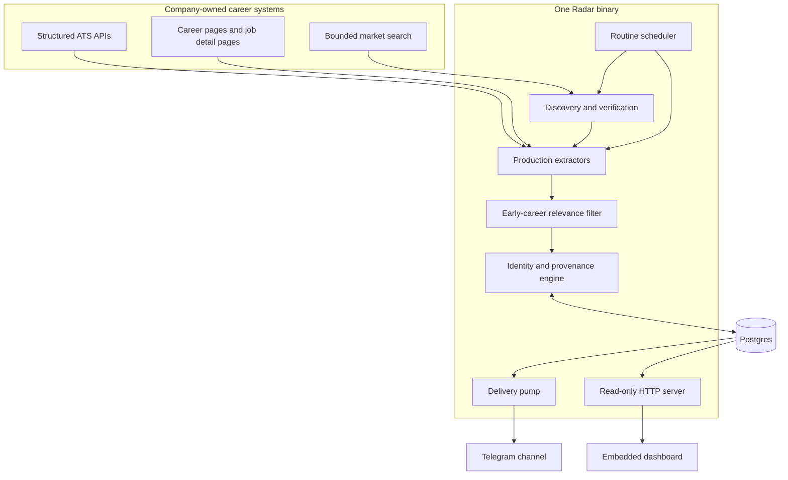
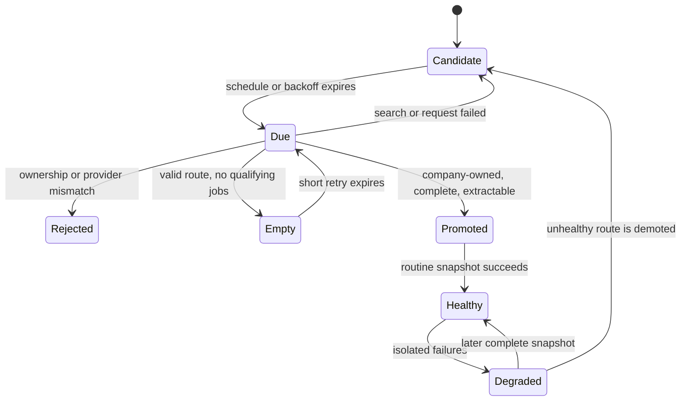
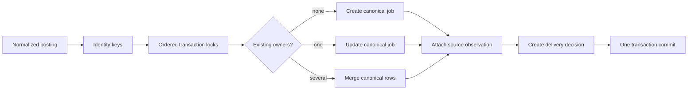
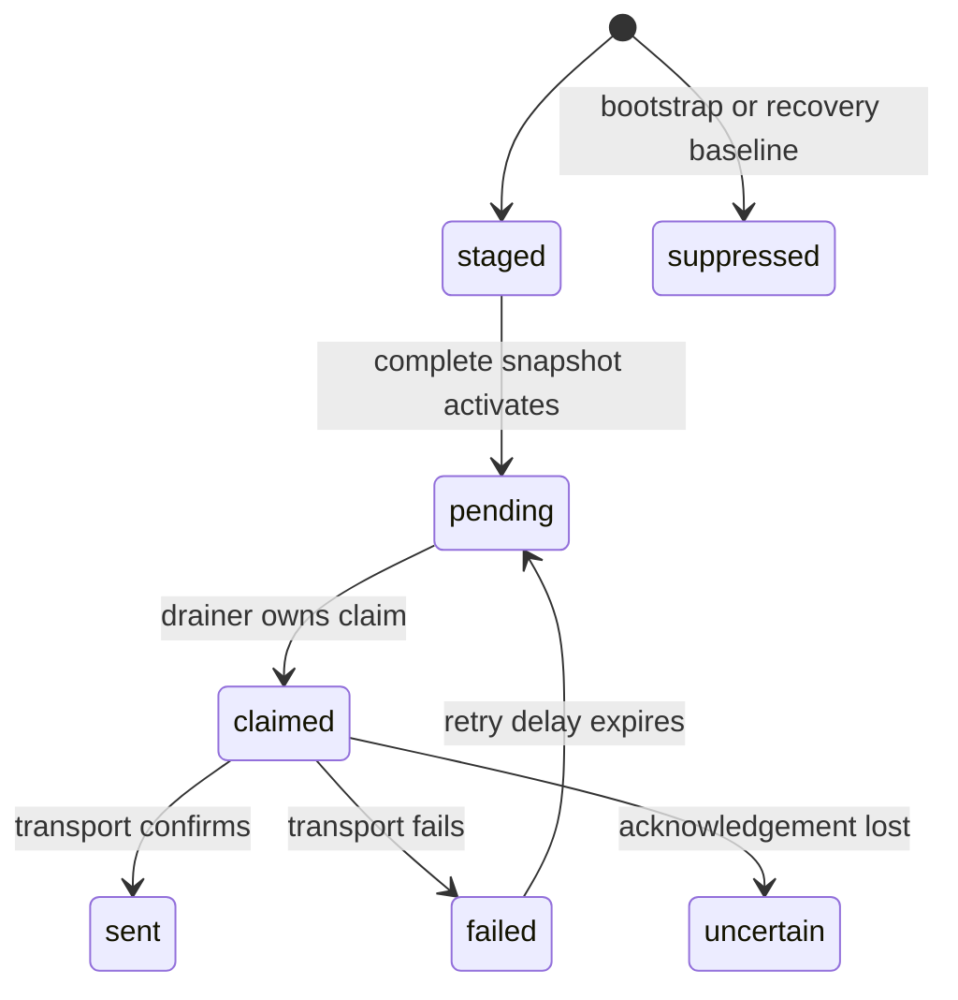
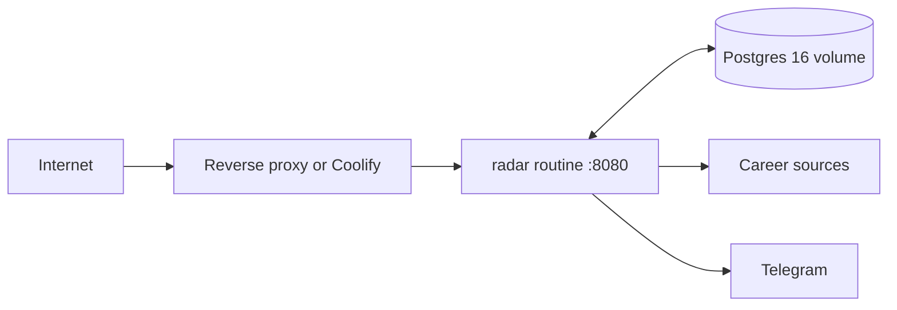

# Radar architecture

This document explains how Radar turns uncertain web evidence into a small,
durable, and auditable early-career job feed. It is the engineering companion
to the public [How it works](https://radar.hwendev.com/docs) page.

## System goals

Radar optimizes for trust before breadth. The architecture exists to uphold six
properties:

1. Jobs originate from company-owned career sources.
2. Discovery cannot bypass production verification.
3. Identity survives title, location, URL, and source changes.
4. Failed or incomplete crawls cannot falsely close healthy jobs.
5. Persistence and delivery decisions cannot diverge.
6. Repeated processes and deployments cannot create repeated alerts.

Those are data guarantees, not presentation choices. Postgres transactions,
unique indexes, advisory locks, and durable state enforce them even after a
process crash.

## System context



There is no separate frontend deployment, queue service, or scheduler. The Go
binary embeds the dashboard assets and exposes the API. Postgres is both the
durable record and the coordination boundary.

## Code ownership

| Area | Owner | Responsibility |
| --- | --- | --- |
| Application | `internal/app` | Modes, configuration, lifecycle, health, and dependency wiring |
| Dashboard | `internal/dashboard` | JSON APIs, presentation, and embedded UI |
| Process entrypoint | `cmd/radar` | Signals, logging, argument forwarding, and exit behavior |
| Pipeline | `internal/pipeline` | Discovery, filtering, identity, provenance, and delivery orchestration |
| Persistence | `internal/postgres` | Connections, migrations, durable state, leases, and outbox storage |
| Source adapters | `internal/source` | Discovery clients, ATS providers, page parsing, and bounded extraction |
| Delivery transports | `internal/delivery` | Log, webhook, and Telegram senders |
| Trusted inputs | `config` | Verified source floor and discovery research queue |

The package boundaries point inward: transports and providers satisfy small
pipeline interfaces; domain logic does not depend on the dashboard or a specific
delivery client.

## Runtime modes and ownership

The same binary supports writer and reader roles.

| Mode | Provider network | Schema migration | Pipeline writes | HTTP |
| --- | ---: | ---: | ---: | ---: |
| `routine` | Yes | Yes | Yes | Yes |
| `once` | Yes | Yes | Yes | No |
| `market-once` | Yes | Yes | Yes | No |
| `reconcile` | Yes | Yes | Yes | No |
| `drain` | Delivery only | Yes | Yes | No |
| `serve` | No | No | No | Yes |
| `discover` / `audit` | No | No | No database | No |

`routine` is the normal production role. `serve` is intentionally read-only:
it cannot migrate, crawl, discover, or deliver. A split deployment may run one
writer and multiple readers against the same schema.

### Cycle ownership

Before a routine cycle starts, the process opens a dedicated Postgres session
and attempts a session advisory lock derived from the schema. Only the lock
holder may crawl or drain delivery. A standby process can keep serving HTTP but
cannot become a second writer. The lock disappears if its session or process
dies.

Durable runtime state records the current owner, cycle start, last completion,
result, and counts. `/readyz` and `/api/status` read that state rather than
guessing health from process uptime.

## One complete routine cycle

```mermaid
sequenceDiagram
    participant R as Routine process
    participant P as Postgres
    participant D as Discovery
    participant E as Extractors
    participant O as Delivery outbox
    participant T as Telegram or log transport

    R->>P: Try advisory cycle lease
    alt lease unavailable
        P-->>R: Standby; no writer work
    else lease acquired
        R->>P: Record cycle start
        par bounded discovery
            R->>D: Resolve due candidates
            D->>E: Verify with production extractor
            E->>P: Promote, back off, or reject route
        and source crawling
            R->>E: Crawl verified sources independently
            E->>P: Reconcile complete snapshots
        and link validation
            R->>P: Select due active apply URLs
            R->>E: Check terminal and soft-404 responses
            E->>P: Persist health and next-check time
        and delivery pump
            R->>O: Claim activated deliveries every 500 ms
            O->>T: Send at transport-safe pace
            T->>P: Mark sent or retryable failure
        end
        R->>O: Final drain
        R->>P: Record result and release lease
    end
```

Source work is isolated. A provider timeout or malformed board contributes a
degraded result but does not block healthy sources, the dashboard, or durable
state.

## Source lifecycle: evidence is not inventory

Radar maintains two different source sets:

- `config/sources.json` is the trusted static floor.
- `config/discovery-seed.json` and database candidates are research inputs.

A candidate moves through this path:



Search results, copied listings, and HTTP 200 responses are not sufficient.
Promotion requires the same production extractor used by routine crawling to
confirm ownership, provider shape, completeness, and usable jobs. Empty,
ambiguous, mismatched, and nontechnical boards remain out of the feed.

## Extraction and relevance

An extractor produces normalized postings plus snapshot completeness. Radar
then evaluates role and career-stage relevance separately from extraction.
This prevents provider-specific code from silently deciding product policy.

The high-signal target is technical internships and new-grad work in software,
ML, data, infrastructure, security, and quantitative engineering. Experienced
roles, management, support, QA-only, generic operations, and other low-signal
categories are suppressed before visibility and delivery.

Completeness matters as much as parsed rows. A failed or partial response may
surface a source-health error, but it cannot reconcile missing postings as
closed. Only a complete successful snapshot replaces active source state.

Source snapshots and apply-link validation cover different failure modes. A
complete snapshot retires a posting that disappears from its board. A bounded
link validator revisits active application URLs in the background, including
URLs an ATS still advertises. HTTP 404, 410, and narrowly recognized soft-404
pages are terminal evidence; two consecutive terminal checks hide the job.
Timeouts, rate limits, authorization responses, and server errors are ambiguous
and never hide it. A refreshed URL resets link state and is checked immediately.

## Job identity and provenance

One real job can appear under multiple URLs, sources, or titles. Radar assigns
identity evidence in descending strength:

1. Native provider identity tied to its source.
2. Canonical application URL.
3. Explicit requisition aliases.
4. A conservative normalized fallback fingerprint.

Title and company alone never identify a job. When a posting contains several
keys, Radar sorts them and acquires transaction advisory locks in stable order.
Existing keys can converge onto one canonical job; if separate canonical rows
are discovered to represent one job, their aliases and observations merge
before the update commits.



`job_source_observations` keeps the answer to “where did this come from?” even
after several sources collapse into one canonical job.

## Persistence model

`internal/postgres/store.go` owns additive, idempotent migrations. The default
schema is `radar_lite` for compatibility with existing deployments.

| Durable object | Purpose |
| --- | --- |
| `jobs` | Canonical role, apply-link health, and first/last seen timestamps |
| `job_identities` | Native ID, URL, requisition, and fallback aliases |
| `job_source_observations` | Source-specific provenance and active sightings |
| `source_status` | Success, healthy-empty, failure, and retry evidence |
| `bootstrap_state` | Initial and recovery baseline suppression |
| `deliveries` | Durable outbox and terminal send state |
| `runtime_state` | Cycle ownership and last-cycle truth |
| `discovery_candidates` | Research schedule, attempts, and backoff |
| `discovered_sources` | Candidate, promoted, unhealthy, and duplicate routes |

See [Data model](data-model.md) for schema rules and test requirements.

## Atomic delivery and replay behavior

Job persistence, identity attachment, source observation, and the delivery
decision happen in one transaction. A unique index enforces at most one row per
`(job_id, channel, recipient)`.



New jobs discovered during a complete source snapshot begin as `staged` and
activate only when the snapshot reconciles successfully. This closes the gap
between “row exists” and “source state is trustworthy.” Expired claims are
replayable after interruption without creating a new outbox row.

No external API can offer true exactly-once delivery: Telegram may accept a
message while its response is lost. Radar stores confirmed provider receipts
and parks ambiguous outcomes as `uncertain` for reconciliation rather than
blindly retrying and producing a duplicate external message.

### Publishing gate

Telegram is active only when all of these conditions hold:

1. `RADAR_LITE_DELIVERY_MODE=telegram`
2. Bot token and chat ID are present
3. `RADAR_LITE_PUBLISHING_ENABLED=true`
4. The user explicitly authorized publishing

Tests and previews blank Telegram credentials and use log delivery.

## Read path and dashboard caching

The embedded HTTP server exposes `/jobs`, `/companies`, `/system`, `/docs`,
`/api/jobs`, `/api/status`, `/healthz`, and `/readyz`. The dashboard is a plain
JavaScript application embedded in the Go binary; there is no frontend runtime
dependency or separate asset server.

The job feed uses three read layers:

1. In-memory request caching for quick tab and filter revisits.
2. A bounded browser cache for immediate stale-while-revalidate rendering.
3. `since=<RFC3339>` incremental reads that return new job bodies plus ordered
   `active_ids` so the client can remove expired jobs safely.

If reconciliation encounters an unknown active ID, the client falls back to a
complete fetch. Cached jobs remain visible when a background refresh fails.
The API itself sends `Cache-Control: no-store`; browser persistence is explicit
application state, not an uncontrolled intermediary cache.

## Health, readiness, and observability

| Surface | Meaning |
| --- | --- |
| `/healthz` | The HTTP process is alive. |
| `/readyz` | The process can serve its configured role using durable state. |
| `/api/status` | Runtime owner, source health, discovery, identity, delivery, and publishing truth. |
| `/system` | Human-readable projection of the durable operational snapshot. |
| Structured logs | Private diagnostics, source events, retries, and process lifecycle. |

A degraded cycle can remain ready because isolated failures do not invalidate
healthy data. A failed or stale cycle requires investigation, but process
liveness alone is never presented as pipeline health.

## Failure model

| Failure | Containment behavior |
| --- | --- |
| One source times out | Record source failure, retain last healthy snapshot, continue other sources. |
| Extraction is incomplete | Do not close missing jobs or activate its staged delivery decisions. |
| Discovery fails | Persist bounded backoff; trusted sources continue. |
| Writer crashes | Postgres releases the session lease; expired delivery claims become replayable. |
| Dashboard refresh fails | Keep the bounded cached feed visible and mark refresh unavailable. |
| Telegram send fails | Retain the outbox row for retry; do not create another decision. |
| Postgres is unavailable | Writer work and readiness fail closed; no alternate in-memory truth is invented. |

## Deployment topology

The default Compose deployment runs one `routine` service and Postgres with a
named persistent volume:



For higher read availability, add `serve` replicas behind the proxy while
keeping one routine writer. Preserve the database volume, schema, channel, and
recipient through code-only cutovers. Changing any of those can create an empty
state namespace or an unintended recovery baseline.

See [Operations](operations.md) for the safe cutover sequence.

## Architectural invariants

| Invariant | Enforced by |
| --- | --- |
| Discovery cannot publish directly | Candidate lifecycle and production extractor verification |
| Failed sources cannot block healthy ones | Per-source execution and degraded cycle reporting |
| Title and company cannot be the sole identity | Ordered alias strength and conservative fallback |
| Missing rows close only after complete snapshots | Source reconciliation boundary |
| Job and delivery decision cannot diverge | Shared Postgres transaction |
| One decision per destination | Unique `(job, channel, recipient)` index |
| Historical baselines do not alert | Bootstrap and recovery suppression state |
| Only one writer owns a cycle | Session advisory lease |
| Read-only replicas cannot mutate pipeline state | `serve` mode boundary |
| External publishing is opt-in | Delivery mode, credentials, explicit gate, authorization |

## Extending Radar safely

### Add a source

Follow [Source lifecycle](source-lifecycle.md). Prefer a verified structured
provider identifier, then run the catalog audit and extractor tests. Never
promote from a search result alone.

### Add a provider

Implement the smallest provider or extractor interface, normalize apply URLs
and native IDs, distinguish healthy-empty from failure, and prove complete
snapshot behavior with fixtures.

### Change identity or persistence

Read `internal/pipeline/AGENTS.md`, `internal/postgres/AGENTS.md`, and
[Data model](data-model.md). Use additive, idempotent migrations and run the
disposable Postgres suite. Identity changes require collision, merge, restart,
and concurrency evidence.

### Change the dashboard or API

Read `internal/dashboard/AGENTS.md` and [HTTP API](http-api.md). Preserve read-only
serving, bounded responses, safe error bodies, accessible loading and failure
states, and complete the real-browser verification pass.
